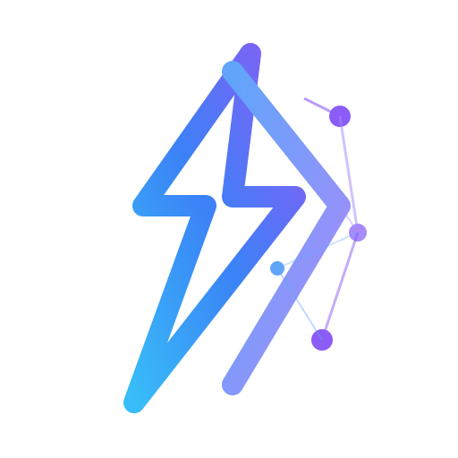

<p align="center">
  
</p>

<h1 align="center">xClaw</h1>

<p align="center">
  <strong>Open-source AI Agent Platform — Multi-industry, Multi-tenant, Plugin-based</strong>
</p>

<p align="center">
  <a href="#quick-start">Quick Start</a> •
  <a href="#architecture">Architecture</a> •
  <a href="#features">Features</a> •
  <a href="#api-reference">API</a> •
  <a href="#domain-packs">Domains</a> •
  <a href="#integrations">Integrations</a> •
  <a href="https://xclaw.xdev.asia/docs">Docs</a>
</p>

---

## Overview

xClaw is a TypeScript monorepo platform for building and deploying AI agents across any industry. It provides a visual workflow builder, RAG pipeline, multi-LLM support, plugin-based domain packs, and a full RBAC multi-tenant architecture — all running on a dual-database design (PostgreSQL + MongoDB).

**Key capabilities:**

- **Multi-LLM** — OpenAI, Anthropic, Ollama (local), Google, Groq, Mistral
- **13 Domain Packs** — General, Developer, Healthcare, Finance, Marketing, Education, Research, DevOps, Legal, HR, Sales, E-commerce, ML
- **11 Integrations** — Gmail, Google Calendar, Notion, GitHub, Telegram, Slack, iMessage, Brave Search, Tavily, HuggingFace, W&B
- **Workflow Engine** — Visual workflow builder with 16 node types (trigger, LLM call, tool call, condition, loop, code, HTTP request, transform, merge, switch, sub-workflow, wait, notification, output, memory-read/write)
- **RAG Pipeline** — Document upload, chunking, embedding (OpenAI or local), semantic search
- **ML/AutoML** — 12 built-in algorithms (regression, classification, clustering, dimensionality reduction, anomaly detection)
- **Multi-tenant RBAC** — Tenants, roles (owner/admin/member/viewer), 60 granular permissions
- **MCP Protocol** — Model Context Protocol server discovery and tool execution
- **Monitoring** — Audit logs, system logs, real-time metrics dashboard
- **Embeddable Chat** — `/embed/chat` route for embedding in third-party apps

## Quick Start

### Prerequisites

- [Docker](https://docs.docker.com/get-docker/) & Docker Compose
- [Ollama](https://ollama.ai/) (optional, for local LLM)

### 1. Clone & configure

```bash
git clone --recurse-submodules https://github.com/xdev-asia/xClaw.git
cd xClaw
cp .env.example .env   # edit with your API keys if needed
```

> If you already cloned without `--recurse-submodules`, run:
> ```bash
> git submodule update --init --recursive
> ```

### 2. Start with Docker Compose

```bash
docker compose up --build
```

This starts 5 services:

| Service      | Port   | Description                    |
|-------------|--------|-------------------------------|
| **xclaw**   | `3000` | API server (Hono)             |
| **web**     | `3001` | Frontend (React + Nginx)      |
| **postgres**| `5432` | PostgreSQL 18 (config data)   |
| **mongodb** | `27018`| MongoDB 7 (AI/chat data)      |
| **redis**   | `6379` | Redis 8 (cache)               |

### 3. Login

Open [http://localhost:3001](http://localhost:3001) and sign in:

```
Email:    admin@xclaw.io
Password: password123
```

### 4. (Optional) Pull an Ollama model

```bash
ollama pull qwen2.5:14b
```

The server auto-detects Ollama at `http://localhost:11434`.

## Architecture

```
┌─────────────────────────────────────────────────────────────────┐
│                        Web Frontend (:3001)                     │
│              React · Tailwind · Zustand · Vite                  │
└────────────────────────────┬────────────────────────────────────┘
                             │ REST API
┌────────────────────────────▼────────────────────────────────────┐
│                     Gateway (Hono) (:3000)                      │
│        Auth · RBAC · Tenant · CORS · Rate Limiting              │
├─────────────┬──────────┬──────────┬──────────┬─────────────────┤
│   Chat API  │   RAG    │ Workflow │ Monitor  │   MCP / OAuth2  │
│   Models    │Knowledge │  Engine  │  Audit   │   Integrations  │
│   Domains   │  Search  │  16 node │  Metrics │   RBAC / Tenant │
│   ML/AutoML │  Upload  │  types   │  Logs    │   Settings      │
└──────┬──────┴────┬─────┴────┬─────┴────┬─────┴────────┬────────┘
       │           │          │          │              │
┌──────▼──────┐ ┌──▼───┐ ┌───▼────┐ ┌───▼───┐ ┌───────▼──────┐
│  Agent Core │ │ RAG  │ │ Tool   │ │ Event │ │ LLM Router   │
│  Skills     │ │Engine│ │Registry│ │  Bus  │ │ OpenAI       │
│  Memory     │ │      │ │        │ │       │ │ Anthropic    │
│  Domains    │ │      │ │        │ │       │ │ Ollama       │
└──────┬──────┘ └──┬───┘ └───┬────┘ └───┬───┘ └──────────────┘
       │           │         │          │
┌──────▼───────────▼─────────▼──────────▼─────────────────────────┐
│                      Dual Database Layer                         │
│  ┌─────────────────────┐  ┌──────────────────┐  ┌────────────┐ │
│  │   PostgreSQL 18     │  │    MongoDB 7     │  │  Redis 8   │ │
│  │   Drizzle ORM       │  │   Native Driver  │  │   Cache    │ │
│  │   13 tables         │  │   6 collections  │  │            │ │
│  │   Config / RBAC     │  │   AI / Chat data │  │            │ │
│  └─────────────────────┘  └──────────────────┘  └────────────┘ │
└─────────────────────────────────────────────────────────────────┘
```

### Dual-Database Design

| Database       | Purpose                        | Tables/Collections                                                                                              |
|---------------|-------------------------------|----------------------------------------------------------------------------------------------------------------|
| **PostgreSQL** | Config & structured data       | tenants, tenantSettings, users, roles, permissions, rolePermissions, userRoles, oauthAccounts, workflows, workflowExecutions, integrationConnections, webhooks, userDomainPreferences |
| **MongoDB**    | AI & conversational data       | sessions, messages, memory_entries, agent_configs, audit_logs, system_logs                                       |
| **Redis**      | Cache layer                    | Session cache, rate limiting                                                                                    |

## Monorepo Structure

```
xClaw/
├── packages/
│   ├── shared/          # @xclaw/shared — Foundation types
│   ├── core/            # @xclaw/core — Agent engine, LLM, RAG, workflow, monitoring
│   ├── db/              # @xclaw/db — Drizzle ORM (PG) + MongoDB driver
│   ├── gateway/         # @xclaw/gateway — Hono HTTP server, REST API, auth
│   ├── server/          # @xclaw/server — Entry point, startup orchestration
│   ├── integrations/    # @xclaw/integrations — 11 service connectors
│   ├── domains/         # @xclaw/domains — 13 industry domain packs
│   ├── skills/          # @xclaw/skills — Built-in skills (defineSkill)
│   ├── skill-hub/       # @xclaw/skill-hub — Marketplace, MCP adapters
│   ├── ml/              # @xclaw/ml — 12 ML algorithms, AutoML
│   ├── cli/             # @xclaw/cli — CLI (commander.js)
│   ├── web/             # React + Tailwind frontend
│   └── channels/        # Channel plugins
│       ├── telegram/    # Telegram bot
│       └── discord/     # Discord bot
├── xclaw-plugins/       # [submodule] Official plugins (ShirtGen, Healthcare)
├── his-mini/            # [submodule] HIS-Mini demo integration app
├── data/
│   └── knowledge-packs/ # Data-only plugin packages (drug DB, ICD-10, etc.)
├── docs/                # Documentation site (Fumadocs + Next.js)
├── docker-compose.yml
├── Dockerfile
└── package.json
```

### Git Submodules

| Submodule | Path | Repository | Description |
|-----------|------|------------|-------------|
| **xclaw-plugins** | `xclaw-plugins/` | [xdev-asia-labs/xclaw-plugins](https://github.com/xdev-asia-labs/xclaw-plugins) | Official plugin packages (ShirtGen.AI, Healthcare) |
| **his-mini** | `his-mini/` | [xdev-asia-labs/xclaw-demo-integration-app](https://github.com/xdev-asia-labs/xclaw-demo-integration-app) | HIS-Mini demo — Hospital Information System integration app |

## Features

### AI Chat

- Multi-turn conversations with streaming responses
- Domain-aware prompting — switch between 13 specialized personas
- RAG-enhanced answers with source citations
- Quick Start prompts (Summarize, Explain, Translate, Code Review, Write Email, Analyze Data)

### Workflow Engine

16 visual node types for building automated pipelines:

| Node Type        | Description                                    |
|-----------------|------------------------------------------------|
| `trigger`       | Manual, scheduled, or webhook trigger          |
| `llm-call`      | Call any LLM with a prompt template            |
| `tool-call`     | Execute a registered tool                      |
| `condition`     | Branch based on expression evaluation          |
| `switch`        | Multi-way branching with cases                 |
| `loop`          | Iterate with max iterations guard              |
| `merge`         | Join multiple branches                         |
| `transform`     | Transform data with JavaScript expressions     |
| `code`          | Sandboxed JavaScript execution (vm)            |
| `http-request`  | External HTTP calls                            |
| `sub-workflow`  | Nested workflow execution                      |
| `wait`          | Delay / sleep                                  |
| `notification`  | Send notifications                             |
| `output`        | Define workflow output                         |
| `memory-read`   | Read from agent memory                         |
| `memory-write`  | Write to agent memory                          |

### ML / AutoML

12 built-in algorithms:

- **Regression:** Linear Regression, Logistic Regression
- **Trees:** Decision Tree, Random Forest, Gradient Boosting
- **Instance-based:** K-Nearest Neighbors, Support Vector Machine
- **Probabilistic:** Naive Bayes
- **Clustering:** K-Means, DBSCAN
- **Dimensionality Reduction:** PCA
- **Anomaly Detection:** Isolation Forest

### Monitoring & Observability

- **System Metrics** — Uptime, memory, CPU, requests/minute, LLM call stats, workflow stats
- **Audit Logs** — User actions tracked with tenant isolation (90-day TTL)
- **System Logs** — Structured application logs with text search (30-day TTL)
- **Dashboard API** — Combined metrics + recent errors + recent audit trail

### Multi-tenant RBAC

- **Tenants** — Isolated data per organization
- **4 System Roles** — Owner (60 perms), Admin (52), Member (14), Viewer (8)
- **15 Permission Groups** — chat, sessions, knowledge, workflows, integrations, domains, settings, users, roles, tenants, models, ml, agents, webhooks, mcp
- **OAuth2** — Google, GitHub, Discord providers

## Domain Packs

| #  | Domain        | Description                              |
|----|--------------|------------------------------------------|
| 1  | General       | Versatile general-purpose assistant       |
| 2  | Developer     | Code review, debugging, architecture      |
| 3  | Healthcare    | Clinical support, drug interactions, ICD  |
| 4  | Finance       | Financial analysis, trading, risk         |
| 5  | Marketing     | Campaign planning, content, analytics     |
| 6  | Education     | Tutoring, curriculum, assessment          |
| 7  | Research      | Literature review, methodology, analysis  |
| 8  | DevOps        | CI/CD, infrastructure, monitoring         |
| 9  | Legal         | Contract review, compliance, regulation   |
| 10 | HR            | Recruitment, policies, employee relations |
| 11 | Sales         | Lead management, CRM, forecasting         |
| 12 | E-commerce    | Product, inventory, customer support      |
| 13 | ML            | Model training, evaluation, deployment    |

## Integrations

| Category       | Integration       | Description                     |
|---------------|------------------|---------------------------------|
| Email          | Gmail             | Send/receive emails via API     |
| Productivity   | Google Calendar   | Event management                |
| Productivity   | Notion            | Database & page management      |
| Developer      | GitHub            | Repos, issues, PRs              |
| Messaging      | Telegram API      | Bot messaging                   |
| Messaging      | Slack API         | Channel & DM messaging          |
| Messaging      | iMessage          | Apple iMessage bridge           |
| Search         | Brave Search      | Web search                      |
| Search         | Tavily Search     | AI-optimized web search         |
| AI             | HuggingFace       | Model inference & datasets      |
| AI             | Weights & Biases  | Experiment tracking             |

## API Reference

### Public Endpoints

```
GET  /health                    # Health check + uptime
POST /auth/login                # Login → JWT token
POST /auth/register             # Register new user
POST /auth/oauth2/:provider     # OAuth2 flow (google, github, discord)
```

### Protected Endpoints (require `Authorization: Bearer <token>`)

```
# Chat
POST /api/chat                  # Send message, stream response

# Knowledge (RAG)
GET  /api/knowledge             # List documents
POST /api/knowledge/upload      # Upload document
GET  /api/search                # Semantic search

# Models
GET  /api/models                # List available LLM models
POST /api/models/pull           # Pull new Ollama model
PUT  /api/models/active         # Switch active model

# Workflows
GET  /api/workflows             # List workflows
POST /api/workflows             # Create workflow
POST /api/workflows/:id/validate   # Validate workflow
POST /api/workflows/:id/execute    # Execute workflow
GET  /api/workflows/:id/executions # List executions

# Monitoring
GET  /api/monitoring/metrics    # System metrics
GET  /api/monitoring/audit      # Audit log trail
GET  /api/monitoring/logs       # System logs
GET  /api/monitoring/dashboard  # Combined dashboard

# Admin
GET  /api/rbac/roles            # List roles & permissions
GET  /api/tenants               # List tenants
GET  /api/settings              # System settings
GET  /api/integrations          # List integrations
GET  /api/domains               # List domain packs
GET  /api/ml/algorithms         # List ML algorithms
GET  /api/mcp/servers           # MCP server discovery
```

## Environment Variables

| Variable            | Default                         | Description                    |
|--------------------|--------------------------------|-------------------------------|
| `PORT`             | `3000`                         | Server port                    |
| `HOST`             | `0.0.0.0`                      | Server host                    |
| `DATABASE_URL`     | —                              | PostgreSQL connection string   |
| `MONGODB_URL`      | —                              | MongoDB connection string      |
| `REDIS_URL`        | —                              | Redis connection string        |
| `JWT_SECRET`       | `xclaw-dev-secret-change-me`   | JWT signing secret             |
| `LLM_PROVIDER`     | `openai`                       | `openai` / `anthropic` / `ollama` |
| `LLM_MODEL`        | auto-detected                  | Model name                     |
| `OPENAI_API_KEY`   | —                              | OpenAI API key                 |
| `ANTHROPIC_API_KEY`| —                              | Anthropic API key              |
| `OLLAMA_BASE_URL`  | `http://localhost:11434/v1`    | Ollama server URL              |
| `CORS_ORIGINS`     | `http://localhost:5173,...`     | Allowed CORS origins           |

## Tech Stack

| Layer       | Technology                                         |
|------------|---------------------------------------------------|
| Runtime     | Node.js 20, TypeScript (ES2022, ESM)               |
| API         | [Hono](https://hono.dev/)                          |
| Frontend    | React 19, Tailwind CSS, Zustand, Vite              |
| PostgreSQL  | [Drizzle ORM](https://orm.drizzle.team/)           |
| MongoDB     | Official Node.js Driver                            |
| Cache       | Redis 8                                            |
| LLM         | OpenAI, Anthropic, Ollama                          |
| Auth        | JWT, OAuth2 (Google, GitHub, Discord)              |
| Build       | Docker multi-stage, npm workspaces                 |
| Docs        | [Fumadocs](https://fumadocs.vercel.app/) + Next.js |

## Development

### Docker (recommended)

```bash
# Build & start all services
docker compose up --build

# Rebuild only the backend
docker compose up --build xclaw

# View logs
docker compose logs -f xclaw

# Stop all
docker compose down
```

### Local Dev (without Docker)

> Yêu cầu: Node.js ≥ 20, npm ≥ 10, PostgreSQL, MongoDB, Redis đã chạy sẵn.

**1. Install dependencies**

```bash
npm install
```

**2. Configure environment**

```bash
cp .env.example .env
# Edit .env with your database URLs and API keys
```

**3. Build packages (first time)**

```bash
npm run build
```

**4. Run database migrations**

```bash
npm run db:migrate
```

**5. Start dev servers**

```bash
# Start both API server + web frontend (concurrent)
npm run dev

# Or start individually:
npm run dev:server    # API server (tsx --watch, hot reload)
npm run dev:web       # Vite dev server (HMR)
npm run dev:docs      # Documentation site (Next.js)
```

### Useful Commands

```bash
# Database
npm run db:generate   # Generate Drizzle migration from schema changes
npm run db:migrate    # Run pending migrations
npm run db:studio     # Open Drizzle Studio (visual DB browser)

# Quality
npm run test          # Run tests (vitest)
npm run lint          # Lint all packages

# CLI
npm run cli -- <command>   # Run xClaw CLI
```

### Project References

Each package declares its dependencies via TypeScript project references. Build order:

```
shared → db → core → integrations → domains → ml → skills → skill-hub → gateway → server
```

### Working with Submodules

```bash
# Clone with submodules
git clone --recurse-submodules https://github.com/xdev-asia/xClaw.git

# Update submodules to latest
git submodule update --remote --merge

# Initialize submodules after a plain clone
git submodule update --init --recursive
```

## License

MIT © [xDev Asia](https://xdev.asia)
